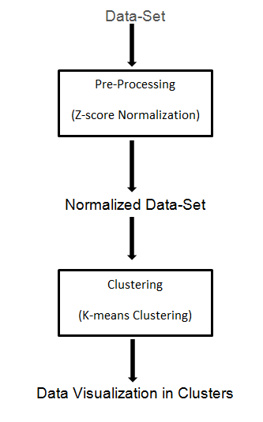
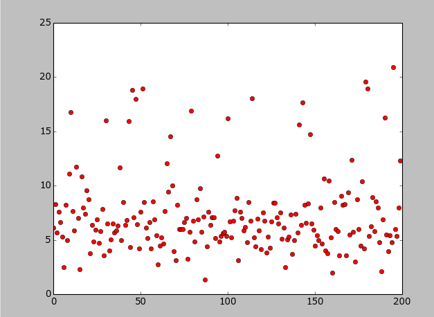
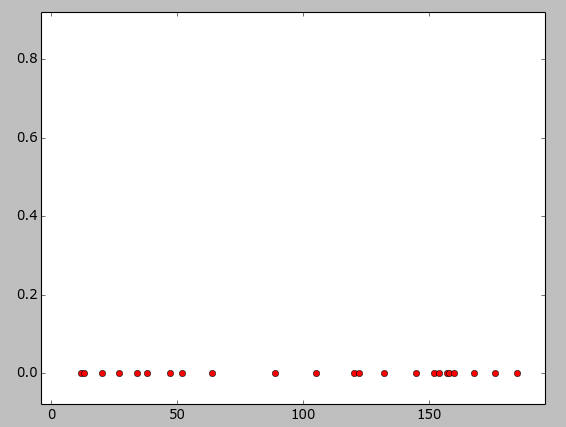
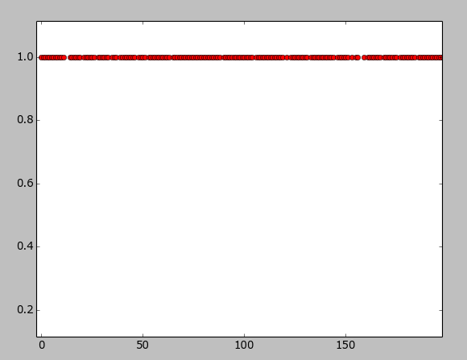
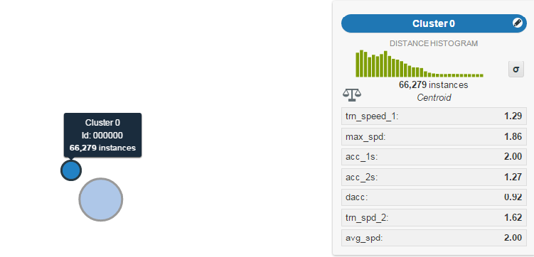
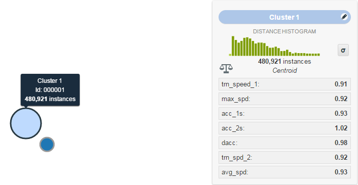

# Driver Telematics Data Analytics using Visualization
For automobile insurers, telematics represents a growing and valuable way to quantify driver risk. Instead of pricing decisions on vehicle and driver characteristics, telematics gives the opportunity to measure the quantity and quality of a driver’s behavior. This can lead to savings for safe or infrequent drivers, and transition the burden to policies that represent increased liability.

The purpose of the Driver Telematics Data Analytics is to discover outliers in a data set of trips.

There are a total of 2730 drivers, each with 200 trips. It is being told that a few of those 200 trips per driver weren’t actually his and the task is to identify which ones. A drive is composed of a series of GPS measurements taken each second. Each drive started at (0, 0) and all the other points were given relative to the origin, in meters. In order to make it harder to match trips to road networks, the trips were randomly rotated and parts from the start and the end were removed.

There are various features used to analyze the driver telematics. They are listed as follows:
* Maximum Speed
* Accelerations
* Accelerations after 2 seconds
* Angle of Rotation
* Angle of Rotation after 2 seconds
* Average Speed
* Deacceleration
* Speeds and Accelerations over larger windows

## Process Flow Diagram

## Implementation Details
* __Normalization__: The data set is first pre-processed using z-score normalization technique.
* __Box-Plot Technique__: The normalized data set is supplied to box-plotting technique to plot the points on the graph and use it to identify the outliers. The outliers are the data points that lie outside the box-plotted and they are the drive that does not belong to the
particular driver.
* __K-means Clustering__: Using this algorithm, there are two clusters formed, the cluster 0 represents the drives that do not belong to the driver and cluster 1 represents the drives that belong to the driver.

### Screenshots
* ___Box-Plot Technique___:

* ___K-Means Clustering___:  
Cluster 0 -->  

Cluster 1 -->  

## BigML Data Visualization
BigML is an online tool whose goal is to create a machine learning service extremely easy to use and seamless to integrate. Using the same tool, we have visualized the cluster formation for the two types of data sets (cluster 0 and cluster 1). The following two figures denotes the overall clusters for all the drivers and their trips.

Cluster 0 -->  

Cluster 1 -->  

